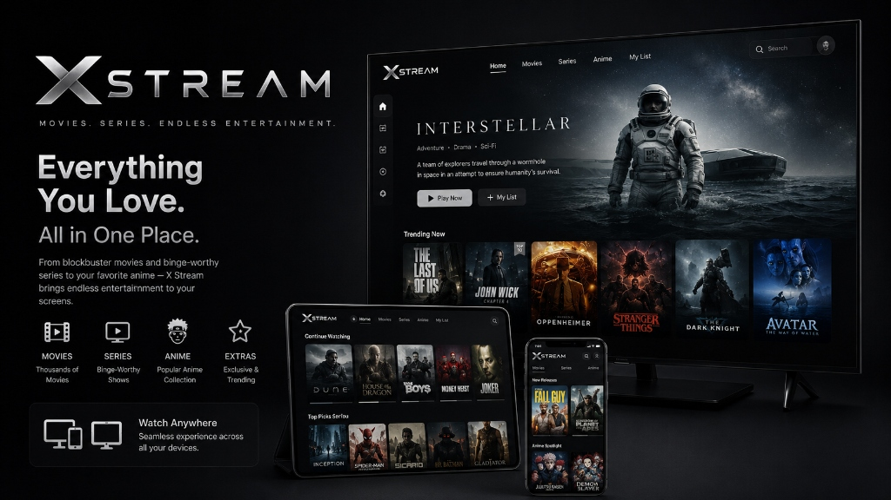

<div align="center">
  

  <br />
  <br />

  <h1>🎬 X-Stream</h1>

  <b>A Highly Realistic, Premium Cinematic Streaming Platform</b>

  <br />
  <br />

  [](https://reactjs.org/)
  [](https://vitejs.dev/)
  [](https://supabase.com/)
  [](https://www.framer.com/motion/)
  [](https://x-stream-tau.vercel.app/)
  
  <br />

  [About](#-about-x-stream) • [Features](#-features) • [Tech Stack](#-tech-stack) • [Installation](#️-installation--setup) • [Contributing](#-contributing)

</div>

---

## 📖 About X-Stream

**X-Stream** is a meticulously crafted streaming platform designed to deliver a premium, cinematic user experience on par with industry-leading video-on-demand services. Engineered with cutting-edge web technologies, it features fluid animations, dynamic color theming, a highly responsive dark mode aesthetic, and robust media playback functionality.

Whether you are browsing movies, checking out TV shows, exploring actor filmographies, or diving into trailers, X-Stream delivers an immersive, app-like experience straight to your browser.

---

## 🚀 Features

### 🎨 Modern & Premium UI/UX
* **Cinematic Dark Theme:** A sleek, eye-catching interface with modern glassmorphism UI elements.
* **Dynamic Color Extraction:** Hero section adapts its color palette dynamically based on the featured movie poster.
* **Accent Color Theming:** Choose from 7 preset accent colors via the Settings modal to personalize the entire UI.
* **Fully Responsive:** Pixel-perfect design optimized for mobile, tablets, and desktops with a dedicated mobile bottom navigation.

### ⚡ Fluid Animations & Interactions
* **Framer Motion Powered:** Smooth page transitions, scroll-reveal animations, spring-physics hover effects, and animated hero content.
* **Lazy Loading:** All movie card images use blur-up lazy loading for lightning-fast perceived performance.
* **Smart Search:** Instantly find what you are looking for with debounced queries, infinite scroll pagination, and media type filters.

### 🎬 Advanced Media Playback
* **30+ Streaming Servers:** Multiple redundant streaming sources with live health checking.
* **Keyboard Shortcuts:** Press `F` for fullscreen, `S` to switch servers, `N` for next episode.
* **Interactive Hero:** Auto-playing hero banners with thumbnail strip navigation and animated transitions.

### 📺 Rich Content Browsing
* **Genre Filtering:** Browse Movies, Series, and Anime by genre with pill-based filters.
* **Actor Pages:** Click any cast member to see their biography, personal info, and full filmography.
* **Studio Pages:** Explore production companies and all their produced films.
* **Top 10 Numbered Rows:** Stylized giant transparent numbers for trending content, just like major streaming platforms.
* **Color-Coded Ratings:** Movie cards display rating badges — green (8+), yellow (6+), red (below 6).

### 🔐 Secure Authentication
* **Supabase Auth:** Fast and secure email/password authentication.
* **User Profiles:** Dedicated profile page with account info and session management.
* **Bot Protection:** Integrated Cloudflare Turnstile CAPTCHA to keep the platform safe.

---

## 💻 Tech Stack

| Category | Technology | Description |
| :--- | :--- | :--- |
| **Frontend Framework** | React 18, Vite | Ultra-fast rendering and build tooling. |
| **Animations** | Framer Motion | Spring physics, page transitions, scroll-reveal. |
| **Styling & UI** | Vanilla CSS | Custom, highly optimized CSS with CSS variables. |
| **Dynamic Colors** | Fast Average Color | Extracts dominant colors from movie posters. |
| **Lazy Loading** | React Lazy Load | Blur-up image loading for performance. |
| **Routing** | React Router DOM | Dynamic client-side routing with AnimatePresence. |
| **Backend & Auth** | Supabase | Robust authentication and database management. |
| **Security** | Cloudflare Turnstile | Advanced CAPTCHA and bot protection. |
| **Deployment** | Vercel | Edge-optimized global deployment. |

---

## 🛠️ Installation & Setup

Follow these simple steps to get a local copy of the project up and running for development and testing.

### Prerequisites

Make sure you have [Node.js](https://nodejs.org/) installed on your machine.

### Local Development

1. **Clone the repository:**
   ```bash
   git clone https://github.com/ShadowByte01/x-stream.git
   ```

2. **Navigate to the directory:**
   ```bash
   cd x-stream
   ```

3. **Install dependencies:**
   ```bash
   npm install
   ```

4. **Set up Environment Variables:**
   Create a `.env.local` file in the root directory and add your keys:
   ```env
   VITE_TMDB_API_KEY=your_tmdb_api_key
   VITE_SUPABASE_URL=your_supabase_url
   VITE_SUPABASE_ANON_KEY=your_supabase_anon_key
   VITE_CAPTCHA_SITE_KEY=your_captcha_key
   ```

5. **Start the development server:**
   ```bash
   npm run dev
   ```
   *The application will typically start on `http://localhost:5173`*

6. **Build for production:**
   ```bash
   npm run build
   ```

---

## ⌨️ Keyboard Shortcuts

| Key | Action |
| :---: | :--- |
| `F` | Toggle fullscreen (Watch page) |
| `S` | Switch to next server (Watch page) |
| `N` | Next episode (TV shows only) |

---

## 🔒 Privacy & Security

X-Stream is a frontend client application. It does not natively store sensitive user payment information or personal data on external unencrypted databases without explicit backend configurations.

* **Authentication:** Handled entirely by Supabase's secure authentication service.
* **API Calls:** All external movie data requests are routed over secure HTTPS connections.

---

## 🤝 Contributing

Contributions are what make the open-source community such an amazing place to learn, inspire, and create. Any contributions you make are **greatly appreciated**.

1. Fork the Project
2. Create your Feature Branch (`git checkout -b feature/AmazingFeature`)
3. Commit your Changes (`git commit -m 'Add some AmazingFeature'`)
4. Push to the Branch (`git push origin feature/AmazingFeature`)
5. Open a Pull Request

---

## 📝 License

Distributed under the MIT License. See `LICENSE` for more information.

<br />

<div align="center">
  <b>Made with ❤️ by Abhinit Kumar</b>
</div>
